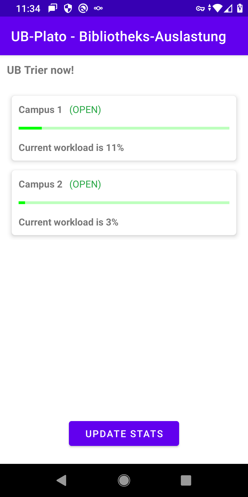

# PlatoOnAndroid

This is an OpenData feasibility analysis as an Android prototype.

This project has been archived and is no longer maintained.
Thank you to everyone who contributed to its development and made it a success.
If you have any questions or concerns, please feel free to contact me directly.

Archive date: 15.04.2024

## Why?

Within my master thesis at the TH Köln I implemented a web service. This prototype was the first
OpenData test against the public API and its documentation.

## What can it do?

At the touch of a button, the data is retrieved via API and displayed with a progress graph. The
picture shows the general UI with two rooms (Campus I and II of the University Library Trier) with
current utilisation in a utilisation graph (libraries are open, utilisation at 11% and 3% with the
coloured representation green').

  <figure>
    
    <figcaption>Screenshot on Android (Version 10, 08.2021)</figcaption>
  </figure>

## Weblinks

- [ub-plato.uni-trier.de](ub-plato.uni-trier.de)
- [API v0.1.3 (SwaggerHub.com)](https://app.swaggerhub.com/apis-docs/deeagle/UB-Plato/0.1.3)
